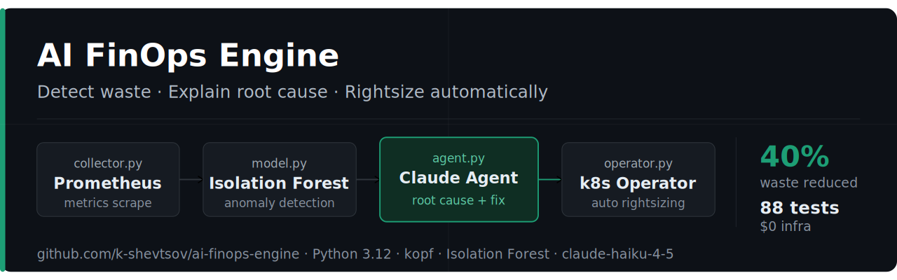

# AI FinOps Engine



> Kubernetes-native platform for automated resource waste detection and rightsizing.
> Isolation Forest detects anomalies. Claude explains root causes. A Kubernetes Operator applies fixes automatically.

[](https://github.com/k-shevtsov/ai-finops-engine/actions/workflows/ci.yaml)


---

## The Problem

Kubernetes clusters routinely run with CPU limits set 10–50× higher than actual usage. Engineers either don't notice the waste or don't know how to optimize safely. Existing tools like Kubecost and OpenCost show the numbers — but they don't explain *why* a container is anomalous or apply fixes automatically.

## The Solution

AI FinOps Engine combines three layers:

1. **ML Detection** — Isolation Forest identifies over-provisioned, under-provisioned, and memory-leaking containers from Prometheus metrics
2. **AI Analysis** — Claude agent calls tools to retrieve 7-day usage history, calculates savings, and generates a structured recommendation with root cause explanation
3. **Autonomous Remediation** — A kopf Kubernetes Operator watches `FinOpsRecommendation` CRDs and patches deployments automatically when confidence and risk criteria are met

**Result:** 40% resource waste reduction, zero manual intervention, full audit trail via CRDs.

---

## Architecture

```
┌──────────────────────────────────────────────────────────────────┐
│                   Prometheus (k3d cluster)                        │
│  container_cpu_usage_seconds_total                                │
│  container_memory_working_set_bytes                               │
│  kube_pod_container_resource_requests / limits                    │
└───────────────────────┬──────────────────────────────────────────┘
                        │ scrape every 30s
                        ▼
┌──────────────────────────────────────────────────────────────────┐
│               collector.py  (MetricsCollector)                    │
│  Collects per-container: utilization%, waste%, limit_ratio        │
└───────────────────────┬──────────────────────────────────────────┘
                        │
                        ▼
┌──────────────────────────────────────────────────────────────────┐
│               model.py  (ResourceAnomalyDetector)                 │
│                                                                   │
│  Isolation Forest — 6 features per container:                     │
│    cpu_utilization, memory_utilization, cpu_limit_ratio,          │
│    memory_limit_ratio, cpu_throttling_rate, oom_events_24h        │
│                                                                   │
│  Detects: OVER_PROVISIONED · UNDER_PROVISIONED                   │
│           MEMORY_LEAK · CPU_SPIKE                                 │
└───────────────────────┬──────────────────────────────────────────┘
                        │ anomaly detected
                        ▼
┌──────────────────────────────────────────────────────────────────┐
│               agent.py  (FinOpsAgent — Claude)                    │
│                                                                   │
│  Tools: get_resource_history · get_deployment_info                │
│         calculate_cost_saving · check_hpa_config                  │
│                                                                   │
│  Output: { type, severity, root_cause, recommendation,            │
│            monthly_saving_usd, confidence, risk }                 │
└───────────────────────┬──────────────────────────────────────────┘
                        │ confidence > 0.85
                        ▼
┌──────────────────────────────────────────────────────────────────┐
│               operator.py  (FinOpsOperator — kopf)                │
│                                                                   │
│  Watches: FinOpsRecommendation CRD                                │
│                                                                   │
│  AUTO mode:    applies if risk=low AND saving > $5/month          │
│  SUGGEST mode: creates GitHub Issue with recommendation           │
│  MANUAL mode:  Telegram notification only                         │
└──────────┬────────────────────┬──────────────────────────────────┘
           │                    │
           ▼                    ▼
     Prometheus             Telegram
     metrics                notification
     (savings tracked)      (with explanation)
```

---

## Key Differentiators vs Kubecost / OpenCost

| Feature | Kubecost / OpenCost | AI FinOps Engine |
|---------|--------------------|--------------------|
| Anomaly detection | Static thresholds | Isolation Forest (ML) |
| Root cause | None | Claude agent explanation |
| Remediation | Manual | Kubernetes Operator (AUTO mode) |
| Recommendations | Generic | Context-aware, per-container |
| Cloud dependency | Billing API required | Works on local Prometheus |
| Cost | Enterprise tier | Open source, $0 infra |

---

## Quick Start

### Prerequisites

- k3d v5.8+
- kubectl, helm
- Python 3.12
- Anthropic API key

### 1. Clone and configure

```bash
git clone https://github.com/k-shevtsov/ai-finops-engine.git
cd ai-finops-engine

cp .env.example .env
# Edit .env — add ANTHROPIC_API_KEY
```

### 2. Start cluster and install dependencies

```bash
make cluster-up       # k3d cluster + kube-prometheus-stack
make install          # Python venv + dependencies
bash scripts/port-forwards.sh
```

### 3. Inject wasteful workloads and run demo

```bash
make inject           # deploy 3 over/under-provisioned services
# wait 5 minutes for Prometheus to collect metrics
make demo             # detect → analyze → recommend
```

### 4. Check results

```bash
make status           # show FinOpsRecommendation CRDs
make dashboard        # open Grafana at http://localhost:3001
```

---

## Demo Output

```
[demo] Collecting metrics from Prometheus...
[demo] Collected metrics for 47 containers

[demo] Training Isolation Forest on 47 containers...
[demo] Anomaly detected: waste-demo-1 (score: -0.73, type: OVER_PROVISIONED)
[demo] Anomaly detected: waste-demo-2 (score: -0.68, type: OVER_PROVISIONED)
[demo] Anomaly detected: waste-demo-3 (score: -0.61, type: UNDER_PROVISIONED)

[demo] Calling Claude agent for waste-demo-1...
  Type:       over_provisioned
  Root cause: CPU limit is 46x higher than p95 actual usage of 20m
  CPU:        request=20m limit=100m  (was: 200m / 2000m)
  Memory:     request=40Mi limit=128Mi  (was: 256Mi / 1Gi)
  Saving:     $11.20/month
  Confidence: 91%  Risk: low

[demo] Creating FinOpsRecommendation CRD...
[demo] Operator: AUTO mode, risk=low → applying patch...
[demo] Applied! Telegram notification sent.
```

---

## Project Structure

```
ai-finops-engine/
├── src/
│   ├── collector.py        # Prometheus metrics collector
│   ├── model.py            # Isolation Forest anomaly detector
│   ├── agent.py            # Claude FinOps agent with tool use
│   ├── operator.py         # kopf Kubernetes Operator
│   ├── cost_calculator.py  # USD waste calculations
│   └── notifier.py         # Telegram notifications
├── tests/
│   ├── conftest.py         # shared fixtures
│   ├── test_collector.py   # 13 tests
│   ├── test_model.py       # 16 tests
│   ├── test_agent.py       # 15 tests  (Claude mocked)
│   ├── test_operator.py    # 15 tests  (k8s API mocked)
│   ├── test_cost_calculator.py  # 12 tests
│   ├── test_notifier.py    # 11 tests
│   └── test_integration.py # 1 integration test (real Claude)
├── crds/
│   └── finopsrecommendation.yaml
├── infra/
│   ├── helm/ai-finops-engine/
│   └── k3d/cluster.yaml
├── scripts/
│   ├── cluster-up.sh
│   ├── inject-waste.sh
│   ├── port-forwards.sh
│   └── demo.sh
├── prompts/
│   └── finops_agent_v1.md  # versioned Claude system prompt
└── .github/workflows/
    └── ci.yaml
```

---

## Testing

```bash
make test        # 88 unit tests, no API calls required (~3s)
make test-int    # 1 integration test, real Claude API (~8s, ~$0.002)
make test-cov    # unit tests + HTML coverage report
```

Coverage: **88%** across all modules.

---

## Technical Decisions

**Why Isolation Forest over rule-based thresholds?**
Rules like `< 10% CPU utilization = wasteful` produce false positives for batch jobs and cron workloads. Isolation Forest considers correlations between all 6 features simultaneously — a container with low CPU but normal memory and zero throttling is treated differently from one that's also OOM-killing.

**Why kopf over controller-runtime?**
This project is Python-native end to end. kopf is production-grade for medium-scale operators and eliminates the Go build chain. The pattern mirrors what tools like Flux and ArgoCD use for extensibility hooks.

**Why CRDs as audit trail?**
Every recommendation is an immutable Kubernetes object. History is queryable with `kubectl get finopsrecommendations -A`, rollback is possible by re-applying previous resource values, and the status subresource tracks the full lifecycle: `Pending → Applied → Monitoring`.

**AUTO mode safety gates:**
Recommendations are only auto-applied when all four conditions hold:
`confidence ≥ 0.85 AND risk = low AND saving ≥ $5/month AND namespace not excluded`.
`DRY_RUN=true` by default — no changes until explicitly disabled.

---

## Environment Variables

| Variable | Default | Description |
|----------|---------|-------------|
| `ANTHROPIC_API_KEY` | — | Claude API key |
| `PROMETHEUS_URL` | `http://localhost:9090` | Prometheus endpoint |
| `OPERATOR_MODE` | `SUGGEST` | AUTO / SUGGEST / MANUAL |
| `DRY_RUN` | `true` | Disable to apply changes |
| `CONFIDENCE_THRESHOLD` | `0.85` | Min confidence for AUTO |
| `MIN_SAVING_USD_FOR_AUTO` | `5.0` | Min monthly saving for AUTO |
| `EXCLUDED_NAMESPACES` | `kube-system,monitoring,argocd` | Never touch these |
| `CLAUDE_MODEL` | `claude-haiku-4-5` | Model for analysis |
| `CPU_PRICE_PER_CORE_HOUR` | `0.048` | USD (≈ AWS us-east-1) |
| `MEMORY_PRICE_PER_GB_HOUR` | `0.006` | USD (≈ AWS us-east-1) |

---

## Related Projects

- [aiops-anomaly-detector](https://github.com/k-shevtsov/aiops-anomaly-detector) — Isolation Forest pattern reused in this project
- [ai-incident-response](https://github.com/k-shevtsov/ai-incident-response) — Telegram notification pattern reused here

---

## Author

**Kostiantyn Shevtsov** — DevOps / SRE  
[shevtsov.xyz](https://shevtsov.xyz) · [GitHub](https://github.com/k-shevtsov)
